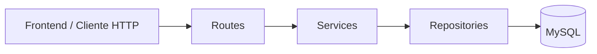

<div align="center">

# Scripta — Backend API

### Plataforma para gestão, avaliação e divulgação de Projetos Integradores

API REST desenvolvida com FastAPI e MySQL para centralizar o ciclo de vida dos Projetos Integradores do Senac Pernambuco.

[](https://www.python.org/)
[](https://fastapi.tiangolo.com/)
[](https://www.mysql.com/)
[](https://jwt.io/)
[](#status-do-projeto)

[Frontend](https://github.com/rbbarros/frontend-scripta) •
[Documentação Swagger](#documentação-da-api) •
[Banco de dados](https://drive.google.com/drive/folders/1GlOyg18-u_pgjzA5FqqzAYEOnuCJgJo2?usp=sharing)

</div>

---

## Sobre o projeto

O **Scripta** é uma plataforma acadêmica criada para centralizar a submissão, o acompanhamento, a avaliação e a divulgação dos Projetos Integradores desenvolvidos por estudantes do Senac.

A aplicação atende quatro perfis de usuário:

* **Aluno:** cria projetos, gerencia integrantes, acompanha avaliações e mantém seu portfólio.
* **Professor:** orienta e avalia projetos.
* **Coordenação:** acompanha o fluxo acadêmico, aprova projetos, emite certificados e gera relatórios.
* **Empresa:** consulta projetos aprovados que foram publicados em portfólios públicos.

O projeto foi desenvolvido como parte do curso de **Análise e Desenvolvimento de Sistemas da Faculdade Senac Pernambuco**.

> Este é um projeto acadêmico e não representa um sistema institucional oficial do Senac.

---

## Problema abordado

Projetos Integradores normalmente ficam distribuídos entre documentos, apresentações, repositórios e diferentes ferramentas de comunicação. Isso dificulta:

* o acompanhamento do desenvolvimento dos projetos;
* a organização das avaliações;
* a preservação do histórico acadêmico;
* a divulgação dos trabalhos realizados pelos estudantes;
* a aproximação entre projetos acadêmicos e empresas.

O Scripta reúne essas informações em um único fluxo, desde a criação do projeto até sua publicação em portfólio.

---

## Principais funcionalidades

### Autenticação e usuários

* Autenticação com JWT.
* Senhas protegidas com bcrypt.
* Controle de acesso baseado no perfil do usuário.
* Cadastro de alunos e professores restrito ao domínio `@edu.pe.senac.br`.
* Cadastro de empresas com e-mail corporativo.
* Coordenadores cadastrados administrativamente.
* Atualização segura dos dados permitidos para cada perfil.
* Proteção contra acesso ou alteração de cadastros de outros usuários.

### Projetos Integradores

* Criação e atualização de projetos.
* Definição de aluno responsável e professor orientador.
* Inclusão e remoção de integrantes.
* Controle do fluxo de status:

```text
rascunho → submetido → em_avaliacao → aprovado ou reprovado
```

* Edição permitida antes do início da avaliação.
* Aprovação e reprovação pela coordenação.
* Registro do histórico de versões após a submissão.

### Avaliações

* Avaliação realizada por professores autenticados.
* Quatro critérios de nota.
* Cálculo da média geral.
* Definição de conceito final.
* Parecer descritivo.
* Uma avaliação por professor em cada projeto.
* Obrigatoriedade de avaliação antes da aprovação ou reprovação.

### Portfólios

* Associação de projetos aprovados ao portfólio dos alunos.
* Configuração individual de visibilidade:

```text
publico
apenas_senac
privado
```

* Cada integrante controla a visibilidade do projeto em seu próprio portfólio.
* Empresas acessam somente projetos publicados como públicos.

### Arquivos e links

* Registro de metadados de arquivos vinculados aos projetos.
* Inclusão de links para repositórios, protótipos, vídeos e demonstrações.
* Gerenciamento realizado pelos integrantes do projeto.
* Alterações permitidas enquanto o projeto estiver em rascunho ou submetido.
* Registro de versão para alterações realizadas após a submissão.

> O MVP registra os metadados dos arquivos. O armazenamento físico dos arquivos não faz parte da versão atual.

### Certificados

* Emissão de certificados para integrantes de projetos aprovados.
* Código único de verificação.
* Prevenção de certificados duplicados.
* Consulta individual pelo aluno.
* Consultas administrativas pela coordenação.

### Ranking e destaques

* Ranking calculado dinamicamente a partir das avaliações.
* Inclusão apenas de projetos aprovados e avaliados.
* Ordenação por média, quantidade de avaliações, título e ID.
* Filtros por curso, turma e semestre.
* Endpoint específico para projetos em destaque.
* Empresas visualizam apenas projetos presentes em portfólios públicos.

### Relatórios

* Relatório geral de projetos.
* Relatório acadêmico.
* Filtros por curso, turma, semestre, status e professor orientador.
* Respostas em JSON.
* Exportação em PDF.

### Auditoria

* Registro interno de ações administrativas.
* Identificação do coordenador responsável pela ação.
* Registro de alterações, exclusões, emissão de certificados e mudanças de status.
* Logs não expostos em rotas públicas da API.

---

## Regras de negócio relevantes

* Alunos e professores utilizam e-mail institucional do domínio `@edu.pe.senac.br`.
* Nome, e-mail e dados acadêmicos de alunos são imutáveis após o cadastro.
* Nome, e-mail e área de atuação de professores são imutáveis.
* Nome empresarial e CNPJ são imutáveis após o cadastro.
* Um aluno só pode alterar o próprio perfil.
* Um professor só pode alterar a própria senha.
* Uma empresa só pode alterar seu e-mail de contato, setor e senha.
* Um coordenador só pode consultar e alterar a própria conta.
* Qualquer integrante pode gerenciar links e metadados de arquivos do projeto.
* Projetos em avaliação, aprovados ou reprovados não podem mais ser editados.
* Um projeto precisa possuir avaliação antes da decisão da coordenação.
* Empresas não acessam avaliações, versões ou dados acadêmicos privados.
* A visibilidade do projeto é definida individualmente em cada portfólio.

---

## Arquitetura

O backend utiliza uma arquitetura em camadas:



### Responsabilidades

| Camada         | Responsabilidade                                                    |
| -------------- | ------------------------------------------------------------------- |
| `routes`       | Receber requisições, aplicar dependências e retornar respostas HTTP |
| `services`     | Executar regras de negócio, autorização e validações                |
| `repositories` | Realizar exclusivamente operações de acesso ao banco                |
| `models`       | Validar entradas e estruturar respostas com Pydantic                |
| `core`         | Centralizar autenticação, segurança e componentes compartilhados    |
| `database`     | Configurar e fornecer conexões com o MySQL                          |

### Estrutura do projeto

```text
backend/
├── app/
│   ├── core/
│   │   ├── auth_core.py
│   │   ├── jwt_handler.py
│   │   └── security.py
│   ├── database/
│   │   ├── database.py
│   │   └── test_db.py
│   ├── models/
│   ├── repositories/
│   ├── routes/
│   ├── services/
│   └── main.py
├── requirements.txt
└── README.md
```

Fluxo principal:

```text
Route → Service → Repository → MySQL
```

As rotas não acessam o banco diretamente, e os repositories não concentram regras de negócio.

---

## Tecnologias

| Tecnologia    | Utilização                               |
| ------------- | ---------------------------------------- |
| Python        | Linguagem principal                      |
| FastAPI       | Construção da API REST                   |
| Uvicorn       | Servidor ASGI                            |
| Pydantic v2   | Validação e serialização de dados        |
| MySQL         | Banco de dados relacional                |
| PyMySQL       | Conexão direta com o MySQL               |
| python-jose   | Criação e validação de tokens JWT        |
| bcrypt        | Geração e verificação de hashes de senha |
| python-dotenv | Carregamento de variáveis de ambiente    |
| fpdf2         | Geração dos relatórios em PDF            |

O projeto utiliza consultas SQL e PyMySQL diretamente, sem ORM.

---

## Segurança

Entre as medidas implementadas estão:

* hash de senhas com bcrypt;
* autenticação stateless com JWT;
* autorização baseada em perfil;
* validação da propriedade dos recursos;
* verificação de participação em projetos;
* restrição de e-mails institucionais;
* bloqueio de campos imutáveis;
* consultas públicas sem exposição de senha;
* validação de acesso a projetos, avaliações, arquivos, versões e portfólios;
* logs administrativos internos;
* configuração de CORS para o frontend local.

O sistema nunca deve armazenar senhas em texto puro.

---

## Como executar o projeto

### Pré-requisitos

* Python 3.14
* MySQL Server
* Git
* PowerShell, terminal ou prompt de comando

### 1. Clone o repositório

```bash
git clone https://github.com/luzvsc/backend-scripta.git
cd backend-scripta/backend
```

### 2. Crie o ambiente virtual

```bash
python -m venv venv
```

### 3. Ative o ambiente virtual

No PowerShell:

```powershell
.\venv\Scripts\Activate.ps1
```

No Prompt de Comando:

```cmd
venv\Scripts\activate
```

No Linux ou macOS:

```bash
source venv/bin/activate
```

### 4. Instale as dependências

```bash
pip install -r requirements.txt
```

### 5. Configure o banco de dados

Crie o banco:

```sql
CREATE DATABASE scripta
CHARACTER SET utf8mb4
COLLATE utf8mb4_unicode_ci;
```

Baixe e execute os scripts disponíveis na pasta:

[Scripts do banco de dados — Scripta](https://drive.google.com/drive/folders/1GlOyg18-u_pgjzA5FqqzAYEOnuCJgJo2?usp=sharing)

### 6. Configure as variáveis de ambiente

Crie um arquivo `.env` dentro da pasta `backend`:

```env
DATABASE_HOST=localhost
DATABASE_USER=root
DATABASE_PASSWORD=sua_senha_do_mysql
DATABASE_NAME=scripta

JWT_SECRET_KEY=gere_uma_chave_secreta_forte
```

Uma chave JWT pode ser gerada com:

```bash
python -c "import secrets; print(secrets.token_urlsafe(64))"
```

> Nunca publique o arquivo `.env` ou credenciais reais no GitHub.

### 7. Teste a conexão

```bash
python -m app.database.test_db
```

Resultado esperado:

```text
Conexão realizada com sucesso
```

### 8. Inicie a API

```bash
uvicorn app.main:app --reload
```

A API estará disponível em:

```text
http://127.0.0.1:8000
```

---

## Documentação da API

Com o servidor em execução, acesse:

### Swagger UI

```text
http://127.0.0.1:8000/docs
```

### ReDoc

```text
http://127.0.0.1:8000/redoc
```

Após realizar login, copie o token retornado e utilize a autenticação Bearer:

```text
Authorization: Bearer <token>
```

No Swagger, clique em **Authorize** e informe o token.

---

## Fluxo de demonstração

Um fluxo completo pode ser testado nesta ordem:

1. Cadastrar um aluno com e-mail `@edu.pe.senac.br`.
2. Cadastrar um professor com e-mail `@edu.pe.senac.br`.
3. Realizar login como aluno.
4. Criar um projeto e selecionar o professor orientador.
5. Adicionar integrantes, links e referências de arquivos.
6. Submeter o projeto.
7. Realizar login como professor.
8. Avaliar o projeto.
9. Realizar login como coordenador.
10. Aprovar o projeto.
11. Emitir os certificados.
12. Adicionar o projeto ao portfólio do aluno.
13. Definir a visibilidade como pública.
14. Consultar o ranking e os projetos em destaque.
15. Realizar login como empresa e visualizar o projeto público.

---

## Status do projeto

O backend está concluído como **MVP acadêmico funcional**.

### Implementado

* autenticação e autorização;
* gerenciamento de usuários;
* projetos e integrantes;
* avaliações;
* portfólios;
* links e metadados de arquivos;
* histórico de versões;
* certificados;
* ranking e destaques;
* relatórios em JSON e PDF;
* logs administrativos.

### Fora do escopo atual

* armazenamento físico de arquivos;
* recuperação de senha;
* confirmação de e-mail por código;
* integração com a base institucional do Senac;
* comunicação direta entre empresas e alunos;
* testes automatizados;
* implantação em ambiente de produção.

---

## Repositórios relacionados

* **Backend:** [github.com/luzvsc/backend-scripta](https://github.com/luzvsc/backend-scripta)
* **Frontend:** [github.com/rbbarros/frontend-scripta](https://github.com/rbbarros/frontend-scripta)
* **Banco de dados:** [Arquivos no Google Drive](https://drive.google.com/drive/folders/1GlOyg18-u_pgjzA5FqqzAYEOnuCJgJo2?usp=sharing)

---

## Minha contribuição

Minha participação no desenvolvimento do Scripta envolveu:

* definição da arquitetura em camadas do backend;
* modelagem conceitual, lógica e física do banco de dados;
* implementação da autenticação com JWT e bcrypt;
* definição e implementação das regras de autorização por perfil;
* desenvolvimento e revisão dos principais fluxos da API;
* integração entre projetos, avaliações, portfólios e certificados;
* auditoria de segurança e proteção das rotas;
* prototipação da experiência do usuário no Figma.

---

## Autoria

Desenvolvido em equipe como Projeto Integrador do curso de Análise e Desenvolvimento de Sistemas da Faculdade Senac Pernambuco.

**Luz Vasconcelos**
Arquitetura de backend, banco de dados, autenticação e prototipação.

[GitHub](https://github.com/luzvsc)

---

<div align="center">

**Scripta — transformando Projetos Integradores em conhecimento acessível e oportunidades.**

</div>
